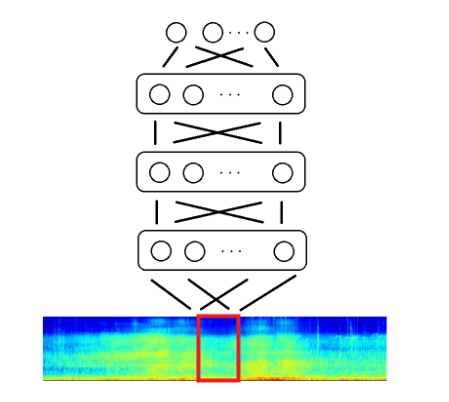

# Deep Neural Network Baseline For Dcase Challenge 2016

*- Qiuqiang Kong, Iwnoa Sobieraj, Wenwu Wang, Mark Plumbley, Detection and Classification of Acoustic Scenes and Events, 2016* [[Paper](http://www.cs.tut.fi/sgn/arg/dcase2016/documents/challenge_technical_reports/DCASE2016_Kong_3008.pdf)]

## Model
The model here uses mel bank features with Deep Neural Network



## Dependenices

This implementation uses Python 2.7, Keras 2.1 and Scikit Learn. The code works on Theano backend.

```
$ pip install requirements.txt
```
## Feature Extraction
- Method Used: Normaized Mel Filter Bank range ~ [0,1]

## Training
- Dataset
    - All files are available to download from [here](http://www.cs.tut.fi/sgn/arg/dcase2016/task-acoustic-scene-classification). Extract the contents according to the path mentioned in the ``` config ``` file
- Development Mode
- Evaluation Mode

## Results
- Dev :                                                         Eva: 

## References
1. https://github.com/qiuqiangkong/DCASE2016_Task1

## License
MIT


