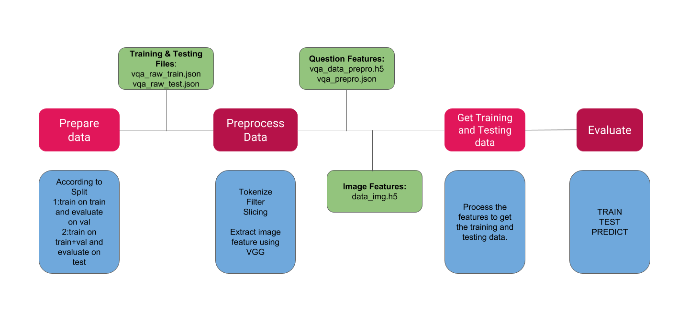

# Exploring Models and Data for Image Question Answering

*Mengye Ren, Ryan Kiros, Richard S. Zemel* [[Paper](https://arxiv.org/pdf/1505.02074.pdf)][[Dataset](http://www.visualqa.org/)]

## Code Workflow



## Train your own Network


### Implemetation Details

There are a total of five files(in order of running them)

- **unpack_vqa.py**: For preprocessing of question data to get question features. (Alternatively, these could be downloaded as mentioned in data folder)
- **extract_features.py**: For processing of image data, to get image features. (Alternatively, these could be downloaded as mentioned in data folder)
- **get_data.py**: Process question and image features to get training and testing data.
- **mainfile.py**: Paths to files are given here. Model is evaluated.
- **my_models.py**: Contains the description of the models.

### Give paths for 

We now give paths. For details, see [data](./data) directory.

```
root_path                 = 'data/'
val_file                  = root_path + 'mscoco_val2014_annotations.json'
input_json                = root_path + 'data_prepro.json'
input_img_h5              = root_path + 'data_img.h5'
input_ques_h5             = root_path + 'data_prepro.h5'

word_emb_dim              = 300
embedding_matrix_filename = root_path + 'embeddings_%s.h5'%word_emb_dim
glove_path                = root_path + 'glove.6B.300d.txt'
```

### Question/Image Feature Extraction

For **VQA**:

Pass `prep = 'dev'` to train on train and evaluate on val, and `prep = 'eval'` train on train+val and evaluate on test.

FOR **VGG** Image feature:


### Load Training Data

We now load the data and check their shape.

```python
train_X, train_Y= get_train_data(input_img_h5, input_ques_h5)
print(train_X[0].shape)
print(train_X[1].shape)
print(train_Y.shape)    
```
*Output:*
```python
(215359L, 4096L)
(215359L, 26L)
(215359L, 1000L)
```

## Model
The model here uses mel bank features with Deep Neural Network.

```python
from my_models import visual_lstm

model = visual_lstm(img_vec_dim, activation_1,activation_2, dropout, vocabulary_size,
                num_hidden_units_lstm, max_ques_length,
                word_emb_dim, num_hidden_layers_mlp,
                num_hidden_units_mlp, nb_classes, class_activation,embedding_matrix,activation_3)
```

### Training

```python

model.fit(train_X, train_Y, batch_size = batch_size, epochs=epochs, validation_data=(test_X, test_Y),verbose=1)
    
```

### Results
 
```python
metric_vals = model.evaluate(test_X, test_Y)
print ""
for metric_name, metric_val in zip(model.metrics_names, metric_vals):
    print metric_name, " is ", metric_val

true_positive = 0
preds = model.predict(test_X)
pred_classes = [np.argmax(_) for _ in preds]
for i, _ in enumerate(pred_classes):
    if _ in multi_val_y[i]:
        true_positive += 1
print "true positive rate: ", np.float(true_positive)/len(pred_classes)

```
*Output:*
```
Accuracy 

```

## References

1. https://github.com/jiasenlu/HieCoAttenVQA
2. https://github.com/anantzoid/VQA-Keras-Visual-Question-Answering
3. https://github.com/iamaaditya/VQA_Keras
