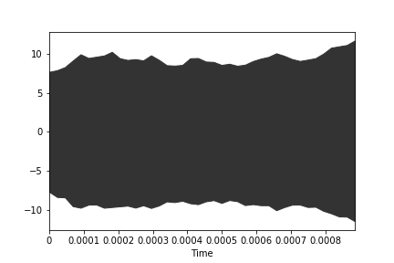
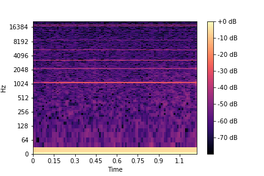

# Keras Audio Library
[](https://github.com/channelCS/keras_aud/blob/master/LICENSE) [](http://deeplearning.net/software/theano/) [](https://keras.io/) 

Neural networks audio toolkit for Keras.

## Running the library
Clone the repo using 
```
git clone https://github.com/channelCS/keras_aud.git
```
and add the **path** to `sys`. 

```python
import sys
sys.path.insert(0, "path/to/keras_aud")
```
- **Extracting audio features**

```python
from keras_aud import aud_audio
aud_audio.extract(feature_name, 'path/to/wavs', 'desired/features/path','yaml_file')
```

- **Making a functional model**

We make a functional CNN `model='CNN'` model in which we pass `train_x` having shape as `(batch_size,1,dimx,dimy)` and `train_y` with shape as `(batch_size,num_classes)`.

```python
from keras_aud import aud_model
miz=aud_model.Functional_Model(model='CNN',input_neurons=400,dropout1=0.1,
    act1='relu',act2='relu',act3=act3,nb_filter = 100, filter_length=5,
    num_classes=15,dimx=10,dimy=40)
```
This returns us a **class** object.

Parameters:
- `dropout1`: Dropout after every layer.
- `act1`: 1st Convolution layer activation.
- `act2`: 2nd Convolution layer activation.
- `act3`: Dense layer activation.
- `nb_filter`: Number of kernels.
- `filter_length`: Size of kernels.
- `input_neurons`: Number of neurons for the dense layer.

We can now fit this model and use the trained model for making predictions.
```python
lrmodel=miz.prepare_model()
lrmodel.fit(train_x,train_y,batch_size=100,epochs=100,verbose=1)
```

- **Extracting a single feature**
We use `aud_feature` to extract features a single `wav` file. We need to provide:
1. A path to the audio in `.wav` format
2. A yaml file containing feature description.
3. The feature we want to extract

We simply pass the required parameters to `extract_one` function.

```python
from keras_aud import aud_feature
aud_feature.extract_one(feature_name = 'mel', wav_file = 'wavs/sample.wav', yaml_file = 'defaults.yaml')
```

- **Plotting the feature**

```python
feature.plot_fig(X)
```


- **Plotting the specgram**

```python
feature.plot_spec(X)
```

